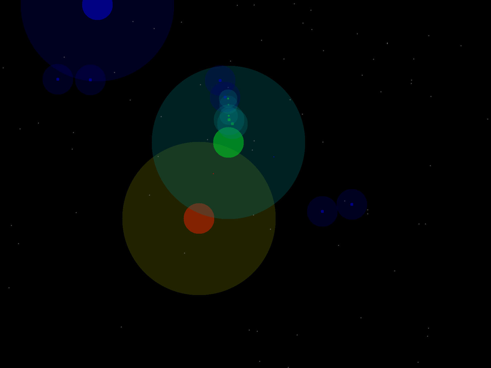

SpaceRobots2 is an AI programming space combat game written in C.

YouTube Channel: https://www.youtube.com/channel/UC7oQ2FDPITHsra6dPuF878Q

----------------------------------------------------------------------

The latest version of SpaceRobots2 can be obtained online at
https://github.com/bob5972/sr2 .

To build/run, this program may require:
* MBLib <https://github.com/bob5972/MBLib>
* libpng <http://libpng.org/>
* SDL <https://libsdl.org/>
* Doxygen <https://www.doxygen.nl/index.html>
----------------------------------------------------------------------

How to add a new fleet:
<ol>
<li>battleTypes.h: Add a new enum value to FleetAIType</li>
<li>fleet.h: Declare your GetOps function</li>
<li>fleet.c: Call your new GetOps function in FleetGetOps</li>
<li>Makefile: Add your new fleet to the C_SOURCES/CPP_SOURCES list</li>
<li>main.c: Configure a battle scenario at the top of main</li>
</ol>

This is still a work in progress, so better directions and a better interface are yet to come.
