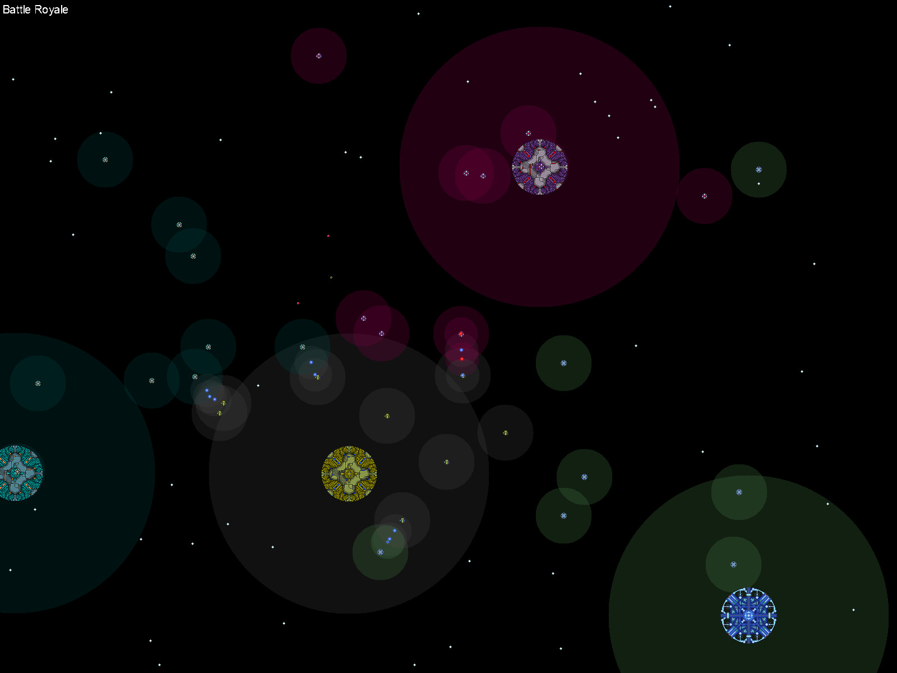

SpaceRobots2 is an AI programming space combat game written in C.

----------------------------------------------------------------------

The latest version of SpaceRobots2 can be obtained online at
https://github.com/bob5972/sr2.

This program requires MBLib as a submodule to build, and SDL to run.

MBLib can be obtained online at https://github.com/bob5972/MBLib .

SDL can be obtained online at https://www.libsdl.org/ .

----------------------------------------------------------------------

How to add a new fleet:
<ol>
<li>battleTypes.h: Add a new enum value to FleetAIType</li>
<li>fleet.h: Declare your GetOps function</li>
<li>fleet.c: Call your new GetOps function in FleetGetOps</li>
<li>Makefile: Add your new fleet to the C_SOURCES/CPP_SOURCES list</li>
</ol>

This is still a work in progress, so better directions and a better interface are yet to come.
